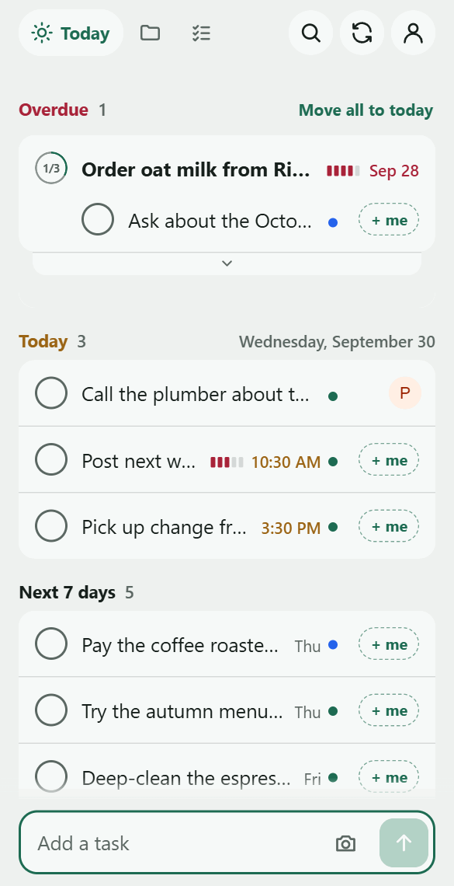
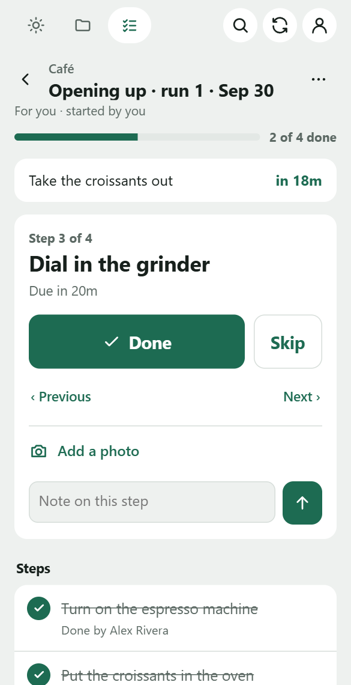

# Pocket for Vikunja

**Tasks and checklists for [Vikunja](https://vikunja.io), on the go.**

Add a task in a line, finish it the same day, hand it to a teammate with an @. Turn the things you do every day, like
opening up and closing down, into checklists that you and your team tick off, step by step.

<table>
  <tr>
    <th>Tasks</th>
    <th>Checklists</th>
  </tr>
  <tr>
    <td></td>
    <td></td>
  </tr>
</table>

Pocket is a home-screen app served by your own Vikunja, through a plugin. There's no app store, no account to make and
no server of its own, and you can read every line before you install it.

<sub>Pocket is an unofficial companion, not made by the Vikunja team. Please report problems with it here, not to
Vikunja.</sub>

## Today's tasks

Type a task the way you'd say it: "Order 6 bags of house blend fri at 9 +orders !3". Pocket highlights what it read and
shows it in chips before you send. **Today** has what's overdue, what's due today and the week ahead. Tick a task off
and it slides away, with an Undo.


## Hand it off

Add `@priya` and the task is Priya's, in a project Priya can see. A checklist run can be for anyone on the team, and
Vikunja tells them about it once, not once per step.


## Checklists for every day

Write the steps once, as a template: "Turn on the espresso machine", "Put the croissants in the oven", "Take the
croissants out in 18 min". Then start a run each morning, for yourself or someone on shift, and work through it one
step at a time, with a note or a photo where it helps. Timed steps count down, and everyone sees who did what.



Pocket works offline, and keeps whatever you're writing until it's sent. It follows the phone's light or dark mode.

## Install

Pocket needs Vikunja 2.7 or later.

1. **Copy the `pocket` folder** from this repo into Vikunja's `plugins` folder, so that you have
   `plugins/pocket/main.go` and `plugins/pocket/app/index.html`. On Cloudron, use the Vikunja app's **File Manager** to
   put it at `/app/data/plugins/pocket/`; elsewhere, `plugins` goes in Vikunja's root path.

2. **Add this to Vikunja's `config.yml`** (`/app/data/config.yml` on Cloudron), then restart Vikunja:

   ```yaml
   plugins:
     enabled: true
     loader: yaegi
     pocket:
       steptimes: true   # timed checklist steps get due dates in Vikunja; leave this line out to keep the plugin read-only
   ```

   Vikunja's log should now include `pocket: serving … at /api/v1/plugins/pocket/`. With step times on, the plugin sets
   the due dates of checklist steps, and changes nothing else: see [Step times](docs/guide.md#step-times). Read
   [`pocket/main.go`](pocket/main.go) first if you like; it's about 350 lines.

3. **Open Pocket on your phone** at `https://<your Vikunja>/api/v1/plugins/pocket/` and sign in the way you sign in to
   Vikunja. You're then signed in to both on that phone.

4. **Add it to your home screen** from the browser's Share or menu button.

**Updating:** replace the files in `plugins/pocket/app/`, then reopen Pocket while online. Only a changed `main.go`
needs a Vikunja restart.

## Using it

**Quick add** reads Vikunja's own shortcuts:

| Type | Sets |
|---|---|
| `+orders` | Project |
| `*suppliers` | Label |
| `@priya` | Who it's for |
| `!1` to `!5` | Priority |
| `tomorrow`, `fri`, `Oct 12`, `in 3 days`, `at 5` | Due date and time. A bare hour is daytime: `at 5` is 5 PM. |
| `every day`, `every monday`, `every other week` | Repeat |

Tap a chip to keep its words in the title instead. A pasted list becomes a task a line, or subtasks of the first.

**Checklists:**

1. Open a project, tap **⋯** and choose **Use for checklists**. Everyone it's shared with gets a **Checklists** tab.
2. Under Checklists, tap **New template** and write its steps, a row each. To time a step, write it in the step:
   "in 18 min", or "20 minutes after Turn on the espresso machine".
3. Tap **Start** and choose who the run is for.
4. Work through it: **Done**, or **Skip**. A note typed on the step goes with it.

**The [guide](docs/guide.md)** has the rest: [every quick add shortcut](docs/guide.md#quick-add), [checklists in
full](docs/guide.md#checklists) and [timed steps](docs/guide.md#timed-steps), [offline](docs/guide.md#offline),
[signing in with an API token](docs/guide.md#signing-in-with-an-api-token),
[troubleshooting](docs/guide.md#troubleshooting), and [privacy and security](docs/guide.md#privacy-and-security).

## Development

All of the app is in `pocket/app/index.html`, with no build step. `npm run dev` starts a local Vikunja with the plugin
loaded. See [docs/development.md](docs/development.md) for the layout, the tests and the bundled libraries.

## License

MIT. See [LICENSE](LICENSE). Alpine.js and chrono-node are also MIT licensed.
