# Pocket guide

The [README](../README.md) says what Pocket is for and how to install it. This is everything else: each screen in full,
quick add's shortcuts, checklists and timed steps, reminders, working offline, API tokens, troubleshooting, and
privacy.

The examples follow a small café: Alex owns it, and Priya is the shift lead who opens up.

- [Pocket and Vikunja's web app](#pocket-and-vikunjas-web-app)
- [Tasks](#tasks)
- [Quick add](#quick-add)
- [Assigning](#assigning)
- [Checklists](#checklists)
- [Timed steps](#timed-steps)
- [Step times](#step-times)
- [Reminders and alerts](#reminders-and-alerts)
- [Opening at once](#opening-at-once)
- [Offline](#offline)
- [Signing in with an API token](#signing-in-with-an-api-token)
- [Troubleshooting](#troubleshooting)
- [Privacy and security](#privacy-and-security)

## Pocket and Vikunja's web app

Vikunja's web app works on a phone, but it's built for a bigger screen. Pocket covers the day on your feet: what's due,
adding and finishing tasks, handing them on, and checklists. Boards, project settings and sharing stay in Vikunja.

<table>
  <tr>
    <th>Vikunja's web app</th>
    <th>Pocket</th>
  </tr>
  <tr>
    <td>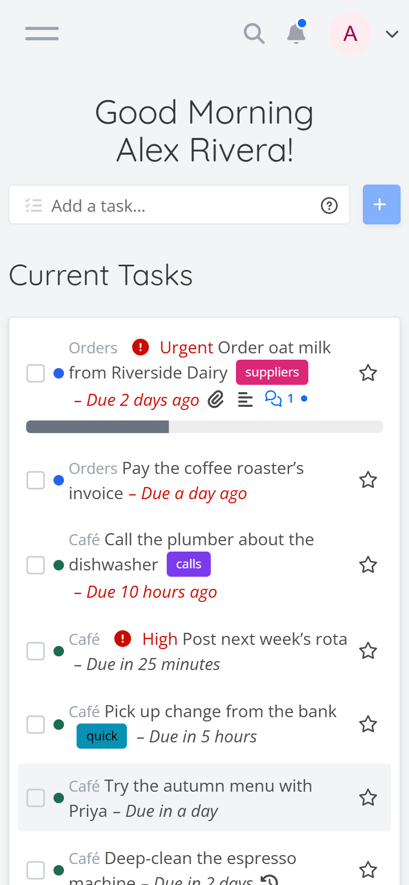</td>
    <td>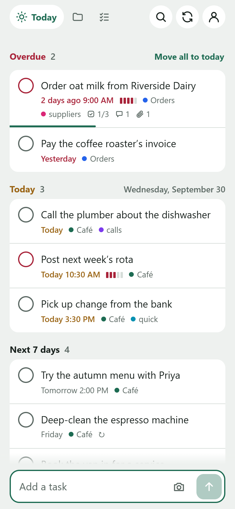</td>
  </tr>
  <tr>
    <td>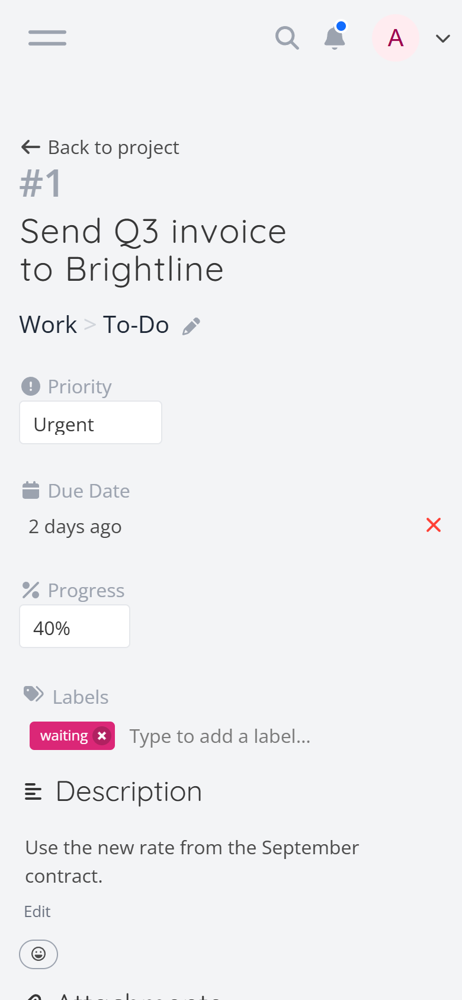</td>
    <td>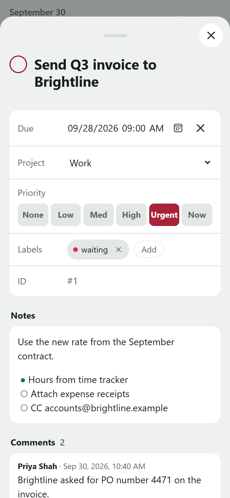</td>
  </tr>
</table>

<sub>Same account, same tasks, same phone-sized screen.</sub>

## Tasks

- **Today** groups tasks into Overdue, Today and Next 7 days, plus **Added today, no date**, so a task added without a
  date stays in view until tonight instead of vanishing into a project. A task with subtasks still open is a card
  there (below), never rows of its subtasks. A task is overdue once its time has passed, as
  in Vikunja: "friday" is due at your default due time, noon unless you changed it. One due at midnight, as Vikunja's
  web app sets a day without a time, is overdue once that day is over. Left open, Today moves tasks to Overdue as their
  time passes, each lighting up for a moment as it moves. **Move all to today** brings every overdue task to today, each
  at the time of day it had, or the next whole hour if that time has gone today; a line under the Overdue heading says
  how many moved, "Moved 6 to today", with **Undo**. A repeating task stays where it is: tick it to move it on to its
  next date. On a card, its task and its subtasks that are overdue themselves are moved; a run's steps stay, as their
  run times them.
- **Today is on one line:** each task there is one line, and the sheet has the rest. Its title
  is cut short with "…" when it's too long, and at the right are its priority's bars, small, as everywhere else (one
  to five, red from high up; none for no priority), then when it's due, short: the time today ("11:55 AM"), the
  weekday this week ("Fri"), or the date beyond ("Oct 20"), red when it's late, with a run's step's countdown instead
  ("in 18m", "12m late"). Under the **Today** heading, a task due today with no time of its own shows no time: the
  heading says it (under **Overdue**, and anywhere else, it still says "Today"). Then its project's colour dot, and
  **+ me** or who's on it. A tick is never coloured: red means late, or Delete. Labels and counts (comments, attachments, subtasks) are left off Today: they're on Projects, in
  search and in the sheet, which keep their second line. A screen reader hears it all: the whole title, when it's due
  in words, its priority and its project.
- **Cards:** a task with subtasks still open (or a checklist run with steps still open) is a card wherever it's
  listed: its header, then its subtasks as rows, a little indented, each working as any task's row does. The header
  has the task's ring where a tick would be (see **Finishing a task with subtasks**, below), its title, which opens
  it, its priority's bars and when it's due (a run's name without the day it was started, "Opening up · run 3"). On
  Today and in search a card is folded to its top row, the subtask to do next: the most urgent, overdue first, then
  due today, then the earliest date, then in its project's **List view** order. A run's top row is its next step in
  order, even one still counting down, with its countdown; a timed step whose time has come goes before it. Under the
  top row, a small tab with ⌄ opens the card where it is, listing every open subtask, and ⌃ folds it again; it also
  folds by itself once you scroll it off the screen, and every card folds when you leave the screen. A card with one
  open subtask has no tab. Ticked, the top row stays on the card, ticked, until the ticks leave together; then the next
  slides up. On a project's list a card is always open, its subtasks in their order, and it moves, held by its header,
  as a task does. A card is set apart from the rows around it by a small gap. Done subtasks are in the task's sheet, or
  on a run's screen. A screen reader hears the card named by its title, with its ring's figure: "1 of 4 subtasks done,
  25%".
- **What brings a card onto Today:** its task being due (overdue, today or in the next 7 days); one of its open subtasks
  being due then; a subtask assigned to you that's due, or that was made today without a date (Vikunja doesn't keep when
  a task was assigned, so one made before today doesn't keep the card there); or, for a checklist run, its being yours
  or your being on one of its steps. A card sits in the group of the earliest date that brought it, as a task by its
  due date; with no date, a run's is under **Checklist runs** and anything else under **Added today, no date**.
- **A task's row** has three parts, each the row's full height: its left edge ticks it (the whole margin, not only the
  circle), its title opens it, and its right end says who's doing it, or **+ me** (see **Assigning**, below). Its
  progress shows in its tick: a quarter, a half or three quarters filled.
- **A row works the same everywhere:** on Today, a project's list, search, a task's sheet and a run's steps. Swipe it
  right to say how far along it is, swipe it left to lower that or delete it, tap its tick to tick it, tap its title to
  open it, and hold it to move it: up or down on a project's list and in a task's sheet, to another day on Today (see
  **Moving a task on Today**), and nowhere in search, whose results have no order of their own. Every swipe and hold has
  a tap that does the same: the tick, the slot, the task's **⋯** and its sheet.
- **Ticking off:** a ticked task stays where it is, at the same height, ticked and struck through, so nothing moves
  under your finger. Tick it again to take it back. Three seconds after your last tick (counted from when your finger
  lifts, and not while it's still on the screen or the list is scrolling), everything you ticked leaves together, the
  tasks below closing up once; leaving the screen sends them at once. Tapping a tick ticks it whatever its progress;
  tapping it again takes it back, with the progress it had. On a project's list, ticked tasks go to its **Done**
  section, whose count goes up; in search, from Open to Done; ticked again in a list of done tasks, they move back the
  same way. A repeating task shows ticked, then comes back open, at its next date, or leaves Today if that's more than a
  week away; ticking it again before then puts its date back. In a task's sheet, a subtask ticked stays there, ticked.
  An Undo leaves alone a task that was changed elsewhere since. A screen reader hears each tick: "Done: Call Ana". With
  less motion asked for on the phone, ticked tasks fade out rather than fold away.
- **Progress:** swipe a task to the right, with no need to hold it first. As it slides, the space it leaves on the left
  is green, with a large ring that fills to 25%, then 50%, then 75% over the first half of the row, with a tick at each
  on a phone that can. Nothing changes until you let go: then the progress shown is set, and the row slides back, its
  tick showing the quarter. Swipe on past half the row, until the green turns solid and the ring shows ✓, and let go:
  the task is done, the row slides on off the screen to the right, and its place stays as a gap with "Done" and
  **Undo** until the ticks leave together. Only the row moves: the green and its ring stay where they are under it,
  so the motion stays smooth on a phone that's saving power. The gap is there as soon as the row has gone, on a slow
  connection too; if the task can't be saved, the row comes back and says so, with **Try again**. Near the screen's right edge, the stops come closer, so done is always within reach.
  To lower it, swipe a task with progress to the left: the ring empties a quarter at a time and stops at 0%, however far
  you pull, and lets go the same way. A done task swiped left opens again, at 75% and on down. The swipe takes over only
  once your finger is clearly going sideways, so a scroll never catches, and not from the screen's very edge, where the
  phone's Back starts; a swipe keeps the side it started on, so pulling back past where you started changes nothing.
  Progress set elsewhere (40%, say) shows as it is until you swipe it. A task with subtasks has no progress of its own
  to swipe: its ring adds up its subtasks'. In a task's sheet, **Details** has **Progress**, 0, 25, 50 and 75%, to tap
  instead. Swiping a task, a subtask or a step no one is doing, in a project shared with someone, says you're doing it:
  once you let go having changed its progress, **+ me** turns into your picture, and it's assigned to you. Someone
  else's stays theirs. Swiping it back to 0% later keeps it yours: tap your picture to let it go. The first time, the
  first task on a screen that you can swipe says "Swipe right to start working on it", until you first set a task's
  progress this way, or tap it away; the phone remembers. It fades where it is, and its space closes a second after
  your finger lifts, so the tasks under it never move while you're touching the list. Swiping never selects text, the
  task's or any near it; a task's notes and comments can still be selected to copy, by holding them. On an iPhone,
  Safari has no way to make the phone tick, so Pocket uses a trick that works since iOS 18 and may stop working; the
  ring's pie always steps at each stop as well, with nothing bouncing. A tap on a tick is felt too, a task's or a
  checklist step's: a firmer tick when it marks it done, as a full swipe gives, and a light one when it opens it again.
- **Finishing a task with subtasks:** its ring is its progress, worked out from its subtasks: each counts its own
  progress, a done one 100%, and the ring shows the average, with how many are done inside it ("1/4"). One subtask at
  50% of four is 13%. Pocket writes that figure to the task's progress in Vikunja too, as its subtasks change. Ticking
  a subtask never closes its task: once they're all done, the card says "All subtasks done" with **Close**, and waits
  for you, so nothing closes behind your back. A subtask added takes **Close** away again. Tapping the ring, or
  swiping the header all the way to the right, completes the task: with one subtask left open, it and the task are
  done at once, with **Undo**; with more, Pocket asks first, naming them: "Its 3 open subtasks will be marked done too:
  Load chairs, Book the hall and Wipe the tables", with **Complete all 4** and **Cancel**. A subtask that repeats is
  left as it is, and the question says so. A partial swipe on the header springs back, as the task has no progress of
  its own; swiped left, the header is its **Delete**. A task done in Vikunja's web app with subtasks still open is a
  card struck through; tap its ring to open it again. A repeating task's ring moves it on to its next date, its
  subtasks as they are.
- **Moving a task on Today:** hold a task's row, or a card, until it lifts: it shrinks to a small box, and a ring of
  dates opens around it, always in the same places, so with practice it's a flick that needs no looking. **Today** is
  to the left and **Tomorrow** to the right; above, an arc of five tiles, Monday to Friday, each the next one of that
  day after tomorrow, with its date (early in the week most are this week's, by Wednesday most are next week's, with a
  gap and a label, "this week" and "next week", where the week changes); and **No date** is a long pull down, past the
  ring, so it's never a slip. Move the box onto one, with a tick felt as you cross into it, and let go: the task moves
  there at once, keeping its time of day, with no Undo; let go in the middle and nothing changes. A target that would
  change nothing (Today, for a task due later today) is dimmed. A card moves only its task's date. A repeating task, a
  checklist that comes round and a run stay where they are, and the ring says why. Weekends, and any other date, are
  the sheet's **Due**.
- **Order:** a project's list is in the order of its **List view** in Vikunja's web app, each subtask under its
  parent in its own order, so both show the same order; a task's subtasks in its sheet are in that order too. To move
  a task, hold it until it lifts, then move it up or down: it follows your finger, with its subtasks, the tasks it
  passes move aside to make room, with a tick at each, and near the top or bottom of the screen the list scrolls on. A
  card moves the same way, held by its header, with its subtasks.
  Let go, and it's there, in Vikunja too. A task moves only among the tasks at its level: a top-level task among the
  top-level ones, a subtask among its parent's subtasks (moving one to another parent is for later). Today and search
  keep their own order, and a done task, one waiting to be sent, or one in a project shared with you to read stays
  where it is. Without a connection, a move is kept and sent later; one Vikunja turns down goes back, and its row says
  why. The task's **⋯** has **Move up** and **Move down**, and **Alt+↑** and **Alt+↓** move the row that has the focus:
  the ways for a keyboard or a screen reader. A project whose List view was deleted in Vikunja is in the order its
  tasks were made, and can't be reordered. A checklist's steps keep an order of their own (see **In Vikunja's web
  app**, under Checklists).
- **Deleting:** swipe a task's row to the left, starting away from the screen's edge, and tap **Delete**; or swipe on
  past half the row, until the word Delete steps to the middle of the row (and, on a phone that can, you feel a tick), and let go. A task with
  progress first swipes down to 0% (see **Progress**), so it takes a second swipe to delete: a slip can't. Back under half before you let go, it's only left open. Swipe
  back, or tap anywhere else, to leave it: the row slides back over the red. Deleted, the row slides on off the screen to the left, and its place stays
  as a gap, at the same height, so nothing moves, with only "Deleted" and **Restore** where "+ me" was: tap anywhere
  on the gap to bring the row back, sliding in from the left. (With less motion asked for on the phone, it doesn't
  slide.) The gap closes with the tasks you ticked, three seconds after the last, and the task is deleted in Vikunja
  then, or as soon as you leave the screen or put Pocket away; nothing is sent before. A task with subtasks asks first,
  before its row goes anywhere, and they go with it; **Cancel** leaves the row where it was. The task's **⋯** deletes it too, the way for a keyboard or a screen reader. Its row turns into the same gap. Without a connection, it's deleted once Pocket reaches Vikunja.
- **The task sheet** starts with the task's own row, as it is in the list, then its notes and its photos and files
  under it, in one card. The row works as in a list: tap the tick, swipe it for its progress (all the way ticks it,
  right there), or swipe it left at 0% to delete it, which closes the sheet on the list, where its gap has **Restore**.
  Tap the title to change it where it is. Then due date and reminders, subtasks, comments, and **Details**: project,
  priority, progress (0, 25, 50 or 75%, a tap each; none for a task with subtasks, whose ring says it), people, labels
  and repeat. **Notes** are the task's own description in Vikunja; **Comments** are Vikunja's comments, a conversation
  under it, as on a checklist run. Changes save as you make them. Subtasks are added with the same box as quick add, except `+project`: a
  subtask stays in its task's project. In a project for checklists it doesn't read dates either, as a task's subtasks
  there may become a template's steps, whose time is their own; a chip says so. Moving a task to another
  project takes its subtasks along. The **⋯** at the top of the sheet shares its progress (see **Sharing progress**,
  below), and deletes it, with its subtasks: its row in the list then is a gap with **Restore**. Tap the project above the title to open it. Adding a subtask, ticking one or setting its progress shows
  on its row only, with no message. A change that isn't saved goes back, and the sheet says so under what it's about
  (at its top, under its notes, under its subtasks), with **Try again** where that helps. A tap anywhere on a row
  like **Due**, **Repeats**, **Reminders** or **Project** works it, not only on its box: the date's calendar, the
  list to pick from, or **Add** for labels and people. The × that clears a date is still its own. Close the sheet with
  its **×**, a tap on the shade above it, the phone's Back, or by pulling it down: by the bar at its top at any time,
  or from anywhere once it's scrolled to its top. While you're typing in it (its title, its notes, a comment, a
  subtask), only the bar pulls it down: a pull beside the box just puts the keyboard away, and a touch in the box is
  the box's own, so the sheet never moves under what you're writing. The notes box grows with what you write, so long
  notes scroll with the sheet. A title or notes you were changing are saved as the sheet closes, whichever way.
- **Sharing progress:** a task's **⋯**, a project's **⋯** and a run's **⋯** have **Share progress as a text**. It opens
  the phone's share sheet, to send it in a message, as a few plain lines:

  ```
  Pack the van  ▰▱▱▱ 38%
  ✓ Load chairs
  ◐ Tables 50%
  ○ Sound system · Priya
  ○ Lights
  ```

  A task with subtasks says what its ring says: the same figure, with a segment for each subtask, filled once it's
  done. A task without has its own progress, on a bar of five. Each
  subtask is ✓ done, ◐ under way (with how far), or ○ not begun, with its own subtasks under it, two spaces in. A person
  is the first word of their name in Vikunja, or their username, and a due date is a few words: "due Fri", "overdue
  since Mon". On a long list, more than 10 lines with more than 5 done, the done ones are one line: "✓ 8 done". A
  project's is its open tasks in its list's order, each with its open subtasks, under its counts: "Café  12 open · 5
  done". A run's says who did each step, "✓ Load chairs · Priya", who skipped one, and who's on the rest. Notes aren't
  included. Where there's no share sheet (on most computers), the text is copied instead, and the sheet says "Copied:
  paste it into a message".
- **Copying:** beside it, for a task and a project, **Copy as a Markdown list** is the copy that comes back. The text you share is what you
  see, for a person to read; the Markdown list is written in quick add's words, so pasted into Pocket's add box it
  makes the same tasks. A task is a heading, then a line for each subtask, with nothing collapsed:

  ```markdown
  ## Pack the van @priya !3 2026-10-16
  - [x] Load chairs
  - [ ] Tables
    - [ ] Legs
  - [ ] Lights (50%)
  - [ ] Sound system @sam *hire every week 2026-10-15 at 15:30
  ```

  Each line says whether it's done, its own progress, who's on it, its priority, its labels and its repeat, with your
  own quick add prefixes, and its due date last: in numbers, with its year, so it means the same day whenever it's
  pasted, and with its time when that isn't your default due time. A task with subtasks has no figure of its own: it's
  worked out again from them. A title that quick add would read words in is quoted, `- [ ] "Lunch friday" @sam`, so it
  comes back as its title (with `'` when it has a `"` in it); most need none. Notes, comments and photos aren't in it.
  A project's copy is one heading, `# Café · 12 open · 5 done`, then its open tasks in its list's order, each with its
  open subtasks; pasted back, the heading is left out and its tasks are made. Its done tasks aren't in the copy.
  A run has no Markdown copy: who did each step, and who skipped one, can't come back as tasks (a name on a done step
  would put that person on a new one, and quick add has no word for skipped). Its text keeps that record, "✓ Load
  chairs · Priya", and a run is made again by starting its checklist. It reads as a task list in a notes app too, and
  Vikunja's own quick add reads most of it (not done, nor progress: there they stay in the title). **Open in Vikunja
  ↗** opens the task, the project or the run in Vikunja's web app. In a task's sheet, the
  copy button beside **Notes** copies its notes as plain text, and the one on each comment copies that comment.
- **Search:** the magnifier finds open and done tasks in all your projects, by words in their title or notes, or by
  number. A ticked result moves from Open to Done. Done shows the 50 done most recently, with a row at its end for 50
  more. A task found with open subtasks is a card, folded to its top row, as on
  Today; a subtask whose task isn't found is a row of its own, saying which task it's under: "↳ Pack the van". Checklist templates and their steps aren't in it: they're under **Checklists** (a template that comes
  round, due, is found).
- **Where Pocket says what happened:** in the place it happened, not at the bottom of the screen. A tick or a deletion
  shows on the task's row itself, which stays until they leave together; a tick that couldn't be saved goes back, and
  its row says why, "Not saved: no connection", with **Try again**. A task added from quick add lights up where it went; if that's not on the screen
  you're looking at (a task due next month, added on Today, or one for another project), a note by the add box says
  where, "Added to Orders, due Friday", with **Open**. The bottom of the screen is left for what has no place of its
  own: a countdown reaching zero, a screen that couldn't load, and what's done once its sheet has closed. A screen
  reader hears each message.
- **Adding subtasks from the bottom box:** on a project's list, the box at the bottom says "Add a task to Moving
  day" and adds tasks to that project. Touch a task (open its sheet and close it, tick it, or swipe its progress) and
  its row lights up, and the box says "Add a subtask to Pack the van": what you type there now goes under that task,
  after its last subtask. Touch a subtask instead, and they go right after it, under its parent: "Add a subtask to
  Pack the van, after Load chairs". A nudge touches a task too. Put your finger on it and
  scroll the list a little, slowly, less than a row's height, and it's the one the box adds to; a longer or quicker
  scroll is only a scroll. The box names it either way, so a wrong one is seen, and **×** undoes it. Press Enter and type the next: the keyboard stays open, and each goes after the one
  before. A subtask ticked done hands the box to its parent, so you can add more beside it. The box reads them as the
  sheet's subtask box does (no `+project`; a pasted list is a subtask a line), with no message: they show on their rows
  at once, and without a connection they wait there and are sent later. The **×** beside the task's name goes back to
  adding a task, and so does scrolling the task off the screen, or leaving the project. A run, a template, a done task
  and a project shared with you to read only can't be added to this way. Today's box always adds a task. On a run's
  screen, the box adds steps (below).
- **Projects:** your project tree with favorites, and the tasks in each: its open tasks, in order, then its done tasks
  in a section of their own, folded, with how many: tap **Done (24)** to open it, the most recently done first. It
  shows the 100 done most recently; with more, a row at its end, **Show 100 more, done before these**, shows the next
  100 (it says how many are left), and each visit to the project starts again at 100. Tick one there to open it again; it goes back among the open tasks. Pocket remembers, for each project, whether you left
  its Done section open. A done task with subtasks still open (ticked done in Vikunja's web app, which leaves its
  subtasks open, or one of them opened again since) stays among the open tasks, a card with its title struck through,
  over those subtasks, so they're never left on their own as if they had no parent. Tap its title to open its sheet;
  tap its ring to open it again where it is. It can't be moved, nor be what the bottom box adds to; its subtasks are
  like any others. In a project for checklists, a run in progress is a card, open, its steps not done its rows; a
  finished one goes to **Done**. Its templates and their steps live under **Checklists** too, so they're not in
  its **Done**, nor are runs' steps. Most of such a project's done tasks are those, so its **Done** says how many once
  it's opened. **New project** makes one, inside
  another if you like. A project's **⋯** shares its progress, and renames or archives it if it's shared with you to write, and deletes it if
  you're its admin. A project shared with you to read only shows its tasks without ticks, and says so.
- **Signing in:** sign in once, with your usual Vikunja login, and Pocket and Vikunja's web app are both signed in on
  that device.
- **On the home screen**, Pocket follows the phone's light or dark mode, and the phone's Back closes an open sheet,
  keeping what you wrote, then steps back through Pocket's screens.
- **A shortcut link:** `…/#/add?text=Order+milk` opens Pocket with the text filled in, handy from an iOS Shortcut or a
  bookmark.

## Quick add

Quick add uses the prefixes and phrases of Vikunja's [Quick Add Magic](https://vikunja.io/help/quick-add-magic/), and
follows your setting for it in Vikunja: the prefixes below, Todoist-style ones (`#project`, `@label`, `+person`), or
none. As you type, the words it reads are highlighted in the box, and chips under it show what will be saved.

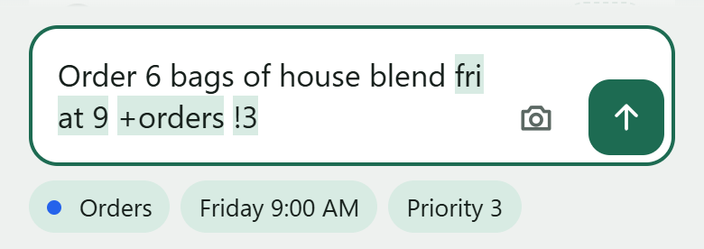

| Type | Sets |
|---|---|
| `+orders` or `+"Café"` | Project: its full name or the start of it |
| `*suppliers` or `*"call back"` | Label, created if it doesn't exist |
| `@priya` | Person to assign, by username. Once assigned, the name leaves the title, as in Vikunja. |
| `!1` to `!5` | Priority |
| `today`, `tonight`, `tomorrow`, `this weekend`, `later this week`, `next week`, `next month`, `end of month` | Due date |
| `friday` or `fri`, `next monday`, `in 3 days`, `in 2 hours` | Due date |
| `Oct 12`, `21st June`, `2026-10-12`, `10/12`, `01.02`, `17th` | Due date. Dates in numbers only, and a bare `17th`, count only at the start or end, so "Table 4/5 wobbles" stays as it is. |
| `at 5`, `at 5pm`, `at 17:30`, `@ 3pm` | Due time. A bare hour is daytime: `at 1` to `at 7` mean the afternoon or evening, `at 8` to `at 11` the morning. Write `am` or `pm`, or `05:00`, to say otherwise. Without a time, the task is due at your default due time from Vikunja's settings, noon unless you changed it. |
| `every day`, `every 3 days`, `every other day`, `every two weeks`, `every month`, `daily`, `weekly`, `biannually` | Repeat. Without a date, it starts at the next due time. Vikunja can't repeat on weekdays only, or on two days a week: `every weekday` or `every monday and thursday` stay in the title, and a chip says so. |
| `(50%)` or `50%`, at the end | Progress, as a swipe would set it; `100%` is done. Pocket's own. |
| `x ` or `[x] `, at the start | Done already. Pocket's own (below). |

- **Suggestions:** as you type a label or a person, chips offer your labels and the people you share projects with,
  those who can see the task's project first. Tap one to finish the word, or press Enter for the first.
- **Read something you didn't mean?** Tap its chip and those words stay in the title. Tap again to undo. To turn it all
  off for one task, wrap the whole text in quotes: `"Friday night jazz poster"`. Quotes round the start of a line hold
  its title and leave the words after them to be read: `"Lunch friday" @priya tomorrow` is "Lunch friday", Priya's, due
  tomorrow. (The words after are Pocket's own: in Vikunja, quotes work only round the whole text.)
- **Pasting a list:** with more than one line in the box, each line becomes a task, with its own dates and shortcuts.
  Bullets, numbering and checkboxes are removed. The
  whole list goes to one project: add `+orders` to any line.
- **Parents in a pasted list:** a line starting `## `, a heading as Markdown notes write one, is a task, and the lines
  under it, up to the next heading, are its subtasks; a `###` heading goes under the `##` before it. A line indented
  more than the line above it is under that line, to any depth, as in Vikunja's web app: spaces or tabs, of any width.
  And for typing, a first line ending with a colon, `Groceries:`, is the parent of the rest, the colon taken off, as a
  list starts in a message. A heading with one `#` is the name of the whole list, as a project's copy starts with
  (below): it's left out, and a chip says so.
  The chip says what
  the list makes: **2 tasks + 7 subtasks**. **↳ Under first line** makes the rest subtasks of the first, for a list
  written without a parent; it shows on by itself when the first line is one, and tapping it off makes them all tasks
  of their own. In a task's subtask box, and the bottom box while it adds subtasks, a heading or an indented line goes
  under the line it's under, which goes under the task; a first line's colon isn't read there.
- **A line that's done already:** an `x` and a space at the start of a line, or a ticked checkbox, adds the task done:
  `x Call the plumber`, `x - Call the plumber`, `[x] Call the plumber`, `- [x] napkins`, `☑ napkins`. It shows ticked
  where it went and leaves with the tasks you ticked, as a tick does; one that repeats moves on to its next date.
  A **Done** chip says so, and the marker is highlighted in the box; tap the chip and the marker stays in the title
  instead, as with any chip. In a pasted list, one chip counts them, **2 arrive done**: tap it to leave those lines
  out, **2 ticked off already: left out**, and again to bring them back.
  Without the space it's a word, so "x-ray the pipe" stays as typed, and so does a capital "X marks the spot". This is
  Pocket's own: Vikunja's quick add has no word for done. It works in quick add and in the subtask boxes, whichever
  quick add mode is set. On a run's screen and in a template's steps, a ticked line is left out instead: a step is done
  by doing it.
- **How far along it is:** a figure at the end of a line, `Tables (50%)` or `Tables 50%`, is the task's progress, as
  swiping its row would set it, and `100%` is done. It can come before the line's other words, `Tables 50% tomorrow
  @priya`, but not in the middle of the title: "Discount 50% on mugs" stays as typed. A task with subtasks has no
  progress of its own, so on a line with lines under it the figure is taken off and dropped. Pocket's own too, and not
  read in a checklist's steps, where "Fill to 50%" is a step's name.
- **New projects:** if a `+project` doesn't exist yet, tap **Create project** to make it.
- **A photo:** the camera button attaches one to the new task.

<table>
  <tr>
    <th>Tap a chip to undo it</th>
    <th>Paste a list</th>
    <th>Create a project</th>
  </tr>
  <tr>
    <td>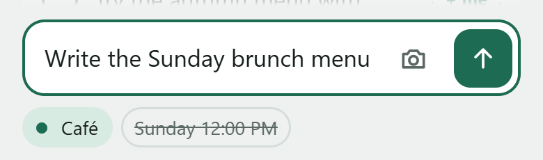</td>
    <td>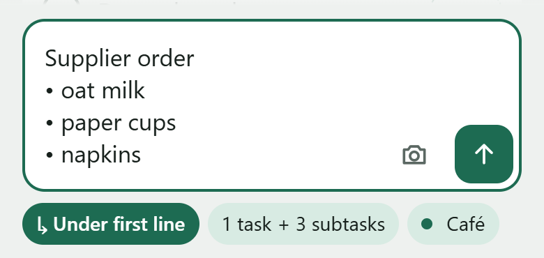</td>
    <td>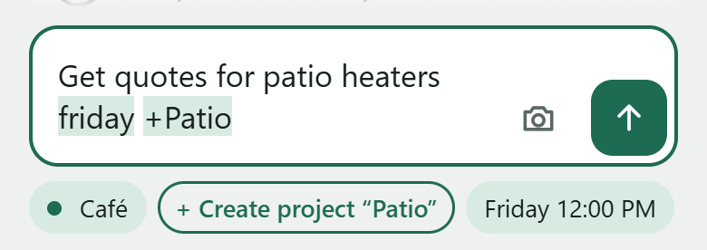</td>
  </tr>
</table>

**Where Pocket's quick add differs from Vikunja's.** The phrases come from Vikunja's own tests, so the same text mostly
gives the same task in both apps. Pocket differs on purpose here:

- A bare hour is daytime: `at 5` is 5 PM. Vikunja reads it as 5 AM.
- `every month` repeats on the same day each month. Vikunja's quick add uses every 30 days.
- Dates always mean the next one: in June, `2nd March` is next March.
- `10/12` follows your phone's region, which is 12 October in most places. Vikunja always reads it US-style.
- A pasted list goes to one project, the first `+project` in it. Vikunja reads each line on its own.
- Pocket also understands `every monday`, `every other day` and `the 17th` anywhere in the text, and drops a word like
  "by" or "in" along with its date.
- Pocket reads a line's `x ` or `[x]` as done and a figure at its end as its progress, where Vikunja leaves both in
  the title; and a `## ` heading as a parent, as well as the indenting Vikunja reads.
- Quotes round the start of a line hold its title, and the words after them are read. In Vikunja, quotes work only
  round the whole text.

## Assigning

`@priya` in quick add, or **Assigned → Add** in a task's sheet, gives the task to someone. They can only be given a task
in a project they can see.

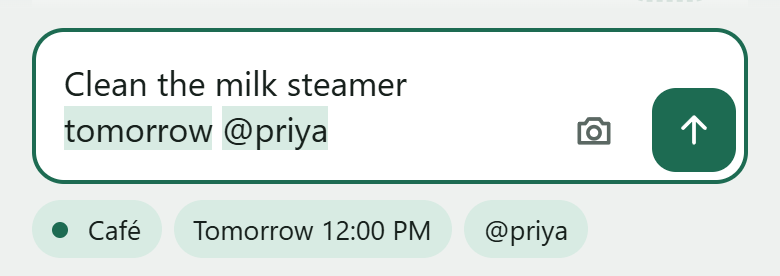

- Without a `+project`: if your default project isn't shared with them but exactly one of your projects is, Pocket picks
  that one and shows it as a chip; tap it to undo. Otherwise a chip says they can't see the project, before you send.
- In the sheet, only people who can see the task's project are suggested.
- A checklist run is for one person, picked when it's started or later from its **⋯**. Vikunja tells them about it once,
  not once per step.

**Who's doing a task, a subtask or a step:** every task's row, every subtask in a task's sheet, and every step of a
run, has a slot at the end of its row. A checklist run's, and a template's that comes round, shows who it's for instead,
as their pictures, and isn't tapped: change it from the run's **⋯**. **+ me** says you'll do it, which assigns it to you; tap your picture to let it go. Someone else's picture
shows who has it. **+ me** shows only where someone else could take it: in a project shared with someone (a person or
a team, there or in a project it's under). In a project only you can see, the slot is empty, your picture isn't shown
either, and swiping progress claims nothing; someone else assigned to it (in a shared project, before it was moved there, say) still shows.
Pocket finds out who can see each project once you're signed in, keeps it on the phone, so Today opens with it, and
looks again as you use it, at most every 10 minutes; until it first knows (or with an API token that can't search a
project's users), every slot shows as in a shared project. To hand one over, open it and use **Assigned** (a run's step: the run's **⋯** → **Open as a task**,
then tap the step). Two people who say they'll do a step
at the same moment don't both get it: the first keeps it, and the other is told. Done or skipped is still recorded for whoever taps it,
whoever has the step, and claiming never ticks anything. A step you claim in someone else's run brings the run onto
your Today, as a card.
Swiping the progress of one no one is doing claims it for you too (see **Progress**, under Tasks).
Vikunja tells the task's creator (for a step, whoever started the run) when you claim it.

## Checklists

Checklists are the things done the same way again and again: opening up, closing down, a delivery check. Each start of
one is a run, with who did each step and when. They're ordinary Vikunja projects and tasks.

<p align="center">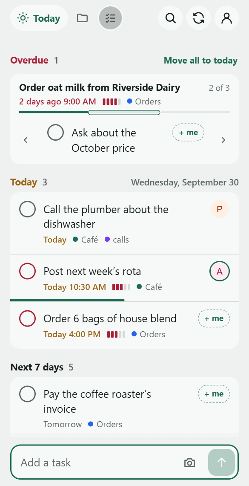</p>

1. **Use a project for checklists.** Under Projects, **Set up checklists** makes a project called Checklists with an
   example template to try, "Example: Opening up": start it, then change it into your own or delete it. Or open a
   project of yours, tap **⋯** and choose **Use for checklists**, or tick **Use for checklists** in **New project**.
   Everyone it's shared with gets a **Checklists** tab. Under Checklists, **Getting started** says what's next, for the
   project's owner, until it's hidden; the project's **⋯** shows it again.
   **Share it** with the people who'll run it. That's done in Vikunja's web app, not in Pocket: the link in Getting
   started, or **Share it in Vikunja** in the project's **⋯**, opens its share page. Pick **Read & write**: Vikunja
   starts on *Read only*, which lets them see runs but not tick steps.
2. **Make a template.** Under Checklists, tap **New template**, name it, and write its steps, a row each: **Enter** or
   **Add a step** starts the next one, and a pasted list becomes a row a line. The name and each step are read as quick
   add reads a task, with the same chips: `@priya` assigns it, `*front` labels it, `!3` sets its priority. Dates aren't
   read there: a step's time is its own, and a chip says so. Each box, empty, says what it reads. Move steps up or
   down, then tap **Make template**. When it comes round, if it should, is set in its sheet once it's made. In a template's sheet, tap a step to change it, or remove it with ×; hold a step, then move it
   up or down, to move it (or tap it, and its **⋯** has **Move up** and **Move down**, as **Alt+↑** and **Alt+↓** do in its
   box). Runs already started keep theirs. **Notes and photos** under it opens the step in its own sheet: each run's copy of the step
   comes with its notes, so that's the place for how to do it. The steps are numbered, as on the Start sheet, not in
   square boxes: those are steps you tick, in a run.
   A template's sheet has what its runs get from it: its notes and attachments (each run's, under **Open as a task** in
   the run's **⋯**), its labels but **template**, its people (who a run is for, to start with) and when it comes round.
   It has no **Comments**, nor has a template's step: Vikunja doesn't copy comments to a run, so they'd reach no one.
   A task with its steps as subtasks can also be made one, with **Use as checklist template** in its sheet's **⋯**.
   Its **template** label is what makes it one, so its sheet doesn't offer to take that off; delete it from its **⋯**.
3. **Start a run.** Tap **Start** and choose who it's for: tap everyone it's for, one or more people who can work on
   the project, the template's assignees to start with. The steps say who each is for. A name, like "Saturday", takes the place of "run 3" in the run's name. A run can be started without a connection, from the templates last
   seen under Checklists, and is set up once Pocket reaches Vikunja. A step assigned to someone in the template stays
   assigned to them in every run.
4. **Work through it.** One step at a time, on its card: **Done**, or **Skip**. A comment typed on the step goes with
   either: Done posts it on the step, and Skip makes it the reason. The run opens on its next step in order, even one
   still counting down, and after Done the next in order is on the card; a timed step whose time has come goes before
   it. Add a photo or a comment to a step, or a
   comment to the whole run (they're Vikunja's comments, which its web app shows too); a step with comments has a mark
   on its row. **Last time** shows the comments from the last finished run of the same template, as a handover, and each step's card shows the ones left on it (ones that come after the
   run is on screen from the next step on, so the steps don't move). The steps listed under the card, under **Steps**,
   say where the run is: tap one to put it on the card, a done one too, and swipe one for its progress as a task's. Who's on the
   step is beside its title, as on its row: **+ me** says you're doing it. A skipped step counts as skipped, not done.
   A run just started says **Started** at its top, with an Undo, until anything's done in it. After the last step, **Finish run**,
   with an Undo.
   The run's own row is at the top of its screen, between Back and **⋯**: its ring, which counts its steps done (a
   skipped one too), its name, which opens its sheet, and who it's for, as their pictures. Tap its ring, or swipe the
   row all the way right, to finish it: with steps not done, it asks first, "Finish this run with 2 steps not done?",
   and they stay not done; with every step done, it's finished at once, with an Undo. A run's ring on Today, on its
   project's list and under Checklists does the same, and with every step done its card says "All steps done" with
   **Close**. On a project's list it then goes to **Done** with the ticks, as a task does. Who started the run, and
   when, is in its **⋯** and at the top of its summary once it's finished.

- **A checklist that comes round:** give the template a date in its sheet, under **When it's due**, and how it
  **Repeats**: every day at 8:00, say. It's then Vikunja's repeating task: at its time it shows on Today, without a tick,
  to its assignees (or, with none, everyone who can work on the project), and Vikunja emails its reminders. Tapping it
  opens Start. Starting a run of it on the day it's due moves it on to its next time, and the run is due at the time
  the template was, so one left open shows as overdue; the Start sheet says which time it's for. A start at 7:55 is the
  8:00 one. One left for weeks moves on to its next time after now: missed times aren't made up. Under Checklists, its
  line says when it's next due. Without a repeat, starting it ends the schedule; taking its date off does too, and
  keeps its repeat for a date given again. On Today before its day, it says **Checklist, for then**: starting it early
  doesn't move it on. **Move all to today** leaves it where it is, and isn't offered when it's all that's overdue. Runs of the same template can be open at once. A task with a due date made a
  template comes round at that date.
- **A step the template doesn't have:** the box at the bottom of a run's screen adds one, as the box on a project's
  list adds subtasks. The line above it says where it goes: "Add a step after “Unlock the door”", the step on the
  card. Type it and press Enter: it's a step after that one, for this run only, and the next one you type goes after
  it, and so on, until another step is on the card (a pasted list is a step a line, in order). To add one somewhere
  else, put that step on the card: tap its row under **Steps**, or nudge it (put your finger on it and scroll a
  little, slowly). With every step done, the box adds after the last. Quick add reads labels, people and priority
  there, but not dates. **Repeat**, on that line, does the step on the card again: a fresh copy of it, not done, with
  the template's notes and photos for it but none of this run's, added there at once, with an **Undo** by the box.
  Either says **Inserted** or **Repeated** under its title, here, in the run's sheet and in Last time, and works like
  any step, offline too. A run finished, or shared with you to read only, has no box. A run's sheet has no subtask
  box: steps are added on its screen, so they're marked. One that isn't done yet can be deleted with the × on its row
  while it's on the card. The template never changes; a step from the template can't be taken out of a run, only
  skipped.
- **Who did a step** is a ✅ reaction on it, or ⏭️ for a skipped one, so Vikunja's web app shows it too, with when:
  "Done by Priya at 4:46 PM". Vikunja lets each person take off only their own ✅, so marking someone else's step not
  done asks first: theirs stays on it. A step ticked on
  Today counts the same.
- **Today** shows your runs in progress, to the person who started the run and the person it's for, each as a card
  (see **Cards**, under Tasks): its heading as a task card's, its ring, its name without the day it was started and,
  if it's due (one started from a template that came round), when, at the right; then its next step, the one its
  screen opens on, with its countdown when the step is timed ("in 18m", "5m late"). A step ticked there is ticked as on the run's screen, with your ✅. A run's card is
  under **Checklist runs**, or with a step due, by that step's date. A run's ring says how far it is, wherever it shows (on
  its card, on its row under Checklists, on its project's list, in search and atop its screen), so a run's row shows who
  it's for, not how many steps are done or which is next. Tapping
  a run's name opens it; tapping a step opens its run on that step.
- **A step has a square box**, wherever it shows: on its run's screen, in the run's sheet, and on Today. A task or a
  subtask has a round one. They work differently (a step's tick records who did it, with its ✅), so they look
  different. A template's steps aren't ticked: they're numbered, plainly.
- **The run on screen** updates by itself as teammates tick steps.
- **A run's ⋯** shares its progress as a text, with who did each step (see **Sharing progress**, under Tasks), changes
  its name and who it's for, opens it as a task, reopens a finished run, and deletes a run with its steps. A run waiting to be set up can be cancelled with its ×. Finished runs are under **Finished lately**.
- **Offline:** ticks, skips, comments and photos are sent once Pocket reaches Vikunja, in the order you did them. A
  **Not done** made offline isn't sent if the run was finished meanwhile. A step inserted offline can be called off from
  Waiting to send; whatever of it reached Vikunja is taken out.
- **In Vikunja's web app**, a template is a task labelled `template`, its title starting "TEMPLATE: " so it isn't
  deleted by mistake, with its steps as done subtasks. It's done, unless it comes round: then it's a repeating task
  there, and ticking it there skips that time without a run. Pocket shows the name without "TEMPLATE: ". A run is a
  copy of it, named like "Opening up · run 3 · Oct 4", which Vikunja links to the template as "copied from". The web app
  can't reorder steps, so reorder them in Pocket. A template is done, and Vikunja's List view leaves done tasks out, so
  a step's place there can't be read back: Pocket keeps the order in a line like `pocket:order 12 15 13` in the
  template's description (the steps' task numbers). Leave that line be; steps it doesn't list, like one added in the
  web app, come last. A run gets a line of its own when it starts, so it keeps the order it was started with, and a step
  inserted in it goes in its line. A step added during a run has a line `pocket:added`. Everyone with *Write* access can
  change templates there too.

## Timed steps

Write the time in the step: "Dial in the grinder **in 20 min**", "Take the croissants out **after 18 minutes**", "Restock
the cups **20 minutes later**". A chip under the step shows what Pocket read, "⏱ 20m after the step before". To count
from another step, pick it in the chip, or write it: "Dial in the grinder **20 minutes after Turn on the espresso
machine**". Tap × to keep the words as they are. Words that tell what to do, like "steam **for** 2 minutes", aren't read
as a time.

Pocket saves the time in the step's title in the template, written the way PLC programs write times, which is also how
to write one in Vikunja's web app:

| In the step | It's due |
| --- | --- |
| `Wipe the counters T#20m` | 20 minutes after the step before it is done. On the first step, 20 minutes after the run starts. |
| `Put the croissants in the oven {#croissants}` | When it's next. `{#croissants}` names the step "croissants". |
| `Take the croissants out T#18m:croissants` | 18 minutes after the step named "croissants" is done, whatever is done in between. |

- Units are `d`, `h`, `m`, `s` and `ms`, and they combine: `T#1h30m`. A step without a `T#` has no due date: it's simply
  next.
- Picking a step to count from gives it a name made from its first words, like `{#put-the-croissants}`.
- A time counts from an earlier step, and each name is used once. Pocket checks this as you write the steps, when you
  move one, and when you start a run.
- A run's steps get their titles without `T#` and `{#…}`.
- A step inserted during a run has no time, and isn't "the step before" for the step after it. A repeated step has no
  time of its own, but a step timed from the one it repeats counts from whichever of them was done last.
- On the run screen, a timed step says what it waits on ("Due 18m after “Put the croissants in the oven”"). Once that
  step is done, it counts down. Countdowns for other steps are pinned above the step on screen, soonest first.

## Step times

Timed steps get due dates in Vikunja, and so show on Today and in Vikunja's web app, through the plugin's step times:
`steptimes: true` in the [install's config](../README.md#install). Without it, Pocket still counts down on the run
screen.

What it does: when a step of a checklist run is marked done (in Pocket, in Vikunja's web app, or through the API), the
plugin sets the due date of each step of the same run timed from it: the time it was marked done, plus that step's
time. When the step is marked not done again, the steps waiting on it lose that due date until it's done again, so no
reminder goes off for a step that's still waiting. It writes only due dates (not even when a task was last changed),
and the time of a reminder counted from the due date, only on steps of that run that aren't done, and only when the
date changes. It only acts on a run Pocket would make: the run and its steps in one project, each step with the time
it was started with (or, for a run started before Pocket kept those, copied from a step of a template labelled
`template` in the project). It doesn't act on templates, or
on a done step saved again. All of it is in one function, `writeStepDueDates` in [`pocket/main.go`](../pocket/main.go).
It can also be turned on with `VIKUNJA_PLUGINS_POCKET_STEPTIMES=true`.

A step ticked offline counts, in Vikunja, from when the tick reaches it. Pocket counts down from when you ticked it.

What it can't do:

- Vikunja's web app, and apps that sync through CalDAV, save a whole task from the copy they loaded. A step saved that
  way from a copy loaded before its due date was set loses the due date again (and its reminder). Pocket still counts
  down to it.
- The plugin sets due dates without changing when a task was last changed, so apps that sync through CalDAV, and
  Vikunja's saved filters, don't see them until the step is changed some other way.
- A tick Vikunja handles while it's restarting, or more than 2 minutes late, sets no due dates.

## Reminders and alerts

Pocket promises only what always works: **timers ring while Pocket is open, and reminders arrive by email when it's
closed.** It shows no system notifications and asks for no permission.

**While Pocket is open:**

- A run's countdown that reaches zero chimes, says so, and vibrates on Android, once per step. The sound is made ready
  when you tap Start or Done, as phones only allow sound after a tap. On an iPhone with the silent switch on, it may not
  sound.
- While a run with a countdown is on screen, the screen stays on, where the phone allows.
- Today moves tasks to Overdue as their time passes, and says when a task's due time or reminder passes while you're
  looking.
- The app's icon shows how many tasks are overdue, on phones that allow it.

**While it's closed, Vikunja emails reminders** to the task's creator and the people it's assigned to. That needs mail
set up on the server (`mailer` and `service.enableemailreminders` in Vikunja's config; on Cloudron, it's set up for
apps already), and reminder emails turned on in your own Vikunja settings. Pocket sets reminders in three places:

- **Reminders** in a task's sheet: at the due time, 15 minutes, an hour or a day before it, which move with the due
  date, or at a set date and time.
- **🔔 in quick add:** type a time ("at 4pm", "in 2 hours") and a 🔔 chip offers a reminder at it. It's off until you tap
  it. A day without a time ("friday") gets none, and it only shows when Vikunja's reminder emails reach you.
- **Timed steps** of a run get a reminder at their due time, which goes to whoever started the run and anyone who's
  claimed the step. It goes off once the plugin's [step times](#step-times) give the step its due date. A step due less
  than a minute after the one it waits on gets none: Vikunja checks reminders once a minute, so it would never be sent.
  Pocket still rings for it while it's open. A step's row shows no 🔔 for it: its countdown says when it's due.

Vikunja's web push, being worked on in [go-vikunja/vikunja#4020](https://github.com/go-vikunja/vikunja/pull/4020), would
let reminders ring the phone too.

## Opening at once

Pocket opens at once, from the copy of itself it saved, and fetches itself behind it: a new version shows the next time
it opens, or as soon as it finds one (when you come back to it, or tap refresh) and you aren't in the middle of
something. Signed in as you were last time, it shows the screen you were on before Vikunja has answered, and sends
nothing you do until Vikunja has said it's you.

Today, a project, Checklists and Projects open at once, with the copy of them Pocket kept last time, while it loads
them again behind. Anything changed since then changes in place: a row ticked elsewhere folds away, one added elsewhere
fades in, and the rest stay as they are, under your thumb. If loading takes over a second, a thin line runs under the
header. While you're on one screen, Pocket loads Today, the project you opened last and Checklists in the background,
one at a time and only when the phone is idle, so they're up to date when you switch to them; not without a
connection, nor when the phone is set to save data. A run opens once it's loaded, with Last time's comments when they
come quickly; ones that come later are shown under the run straight away, and on a step's card from the next step on,
so the steps never jump down under your thumb.

What you do shows at once too. A new task is on its list straight away, where it will be; it looks waiting (a light
tint and a dashed circle, or "waiting to send" on a run's step) only if Vikunja hasn't answered after a few seconds,
and right away without a connection. If Vikunja turns it down, it goes back as it was, and says so.

## Offline

Pocket opens without a connection and shows your lists as they were last loaded.

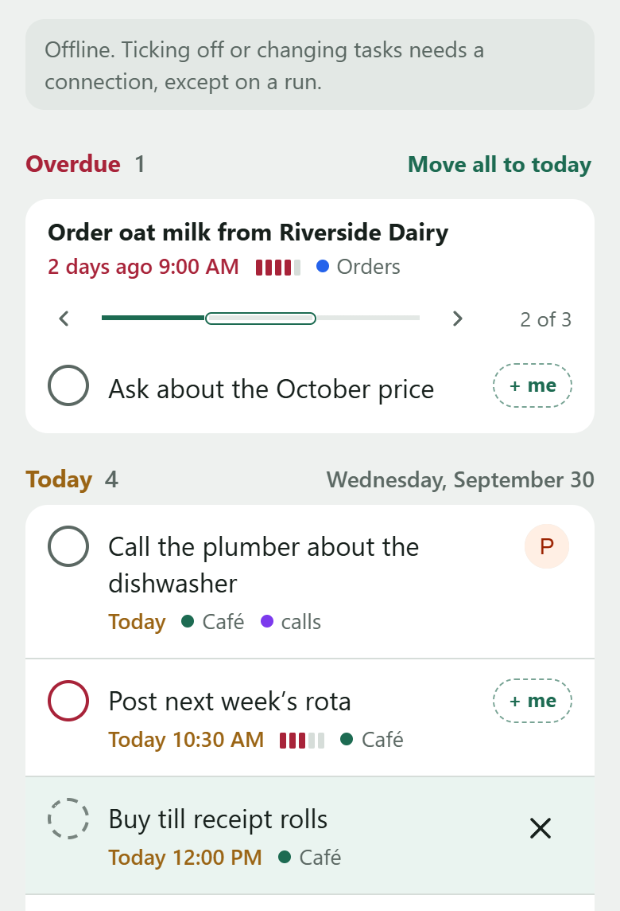

- **What works offline:** new tasks and subtasks, comments, and what you do in a checklist run. A task waiting to be
  sent has a light tint and a dashed circle (online, once it has waited a few seconds); its × cancels it and puts its
  words back in the box. Ticking off or editing
  other tasks needs a connection.
- **What's waiting:** while anything waits to be sent (without a connection, or for more than a few seconds), the
  refresh button at the top turns amber, with how many. Tap it
  for **Waiting to send**: each thing in words ("Done: Check the milk fridge", "Photo for “Restock cups”"), when you did
  it, and **Don't send it** on anything not started yet. **Try now** sends what it can.
- **Nothing you write is lost:** a comment (on a task, a run or a step), notes, subtasks or a new template is kept on
  the phone until it's sent, even if Pocket is closed, and through a sign-in that runs out. A task or comment Vikunja turns down for good
  says what it was, and its words go back in the box. A tick, skip, claim or finish it turns down is kept: the button
  turns red, and Waiting to send says why, with **Try again** and **Don't send it**. Until then, anything done after it
  on the same task waits behind it. Notes someone changed elsewhere while you wrote yours aren't written over: both are
  shown, and saving again replaces theirs.
- **Sending:** waiting things are sent when Pocket is opened, when it comes back to the front, and when the connection
  returns, in the order they were done, and a connection that drops halfway doesn't send anything twice. Vikunja not
  answering within 20 seconds counts as no connection. On an iPhone, waiting things are sent the next time Pocket is
  opened, since iPhones don't let web apps send in the background.

## Signing in with an API token

If single sign-on and passwords don't suit you, Pocket also takes an API token. In Vikunja, go to *Settings → API
Tokens*, choose the **Task Management** preset, and also tick:

- **User** and **Users** under *Other*, and **Users search** under *Projects*: to find people for `@priya` and check that
  they can see the task's project. Without **Users search**, `@priya` still works, but people aren't suggested and no
  project is picked for them.
- **Create**, **Update** and **Delete** under *Projects*: to create projects from quick add, to rename, archive and use
  them for checklists, and to delete them.
- **Reactions**: for checklists, to record who did each step.

The preset already includes what moving tasks needs: **Position** under *Tasks*, and reading a project's views. A token
made without them shows each project in the order its tasks were made, and a move says which permission is missing.

A token is kept by Pocket alone, so signing in or out of Vikunja's web app doesn't affect it.

## Troubleshooting

- **Pocket's address shows "not found":** look for lines mentioning `pocket` or `plugin` in Vikunja's log.
  - `couldn't find app/index.html`: the files aren't at `plugins/pocket/app/`.
  - `Failed to load yaegi plugin pocket`: the plugin didn't load, for example because a Vikunja update changed how
    plugins work. Vikunja itself keeps running.
  - Nothing at all: plugins aren't turned on, or Vikunja hasn't been restarted since.
- **Stuck on Vikunja's page after single sign-on:** on the home screen, single sign-on opens in the same window and ends
  on Vikunja's page. Close that page to come back to Pocket. In a browser, it opens a new tab that closes by itself.
- **"Too many attempts from here":** Vikunja allows 10 sign-in attempts a minute from one address. Wait a minute.
- **"That token didn't work":** the token has expired, or **User** under *Other* isn't ticked.
- **"Your API token doesn't allow this":** the token is missing a permission ([see above](#signing-in-with-an-api-token)).
  Vikunja can't add permissions to an existing token, so create a new one.
- **"@priya can't see Inbox":** you can only assign people a project is shared with. Add a `+project` they can see, or
  share the project with them in Vikunja.

## Privacy and security

- Pocket has no server of its own. Vikunja serves its files, and Pocket only talks to that same Vikunja.
- Pocket uses Vikunja's own sign-in, stored in the browser where Vikunja's web app keeps it, and renews it the way
  Vikunja does. To revoke an API token entirely, delete it in Vikunja.
- To open at once and offline, Pocket keeps the lists it last loaded, what's waiting to be sent, and what you're still
  writing, in the browser on that device. Signing out removes them, and asks first if something is still waiting.
  Someone else signing in on that device never sees them: Pocket drops another account's lists before showing any. To
  know a sign-in is the one it last saw as yours, it keeps a fingerprint of it (its SHA-256 hash), never the sign-in
  itself.
- Notes and comments are cleaned before they're shown, and attachments other than images, PDFs and plain text are
  downloaded instead of opened. Together, these stop content from people you share projects with from running code
  inside Pocket, which shares its web address with Vikunja.
- The plugin runs inside Vikunja, so read [`pocket/main.go`](../pocket/main.go) before installing it. It serves the
  files in its `app/` folder and, with step times on, sets the due dates of checklist steps, and nothing else.
